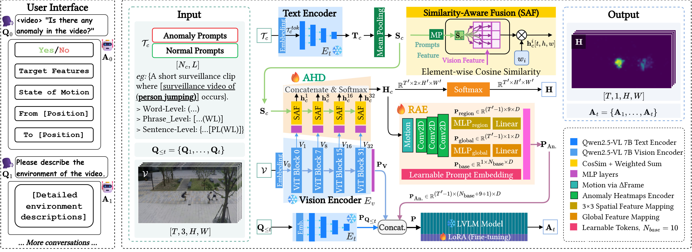

<div align="center">
<h1>Text-guided Fine-Grained Video Anomaly Understanding</h1>


[**Jihao Gu**](https://scholar.google.com/citations?hl=en&user=fSWwq3AAAAAJ)<sup>1</sup>, [**Kun Li**](https://scholar.google.com/citations?user=UQ_bInoAAAAJ)<sup>2 :email: </sup>, [**He Wang**](https://drhewang.com/)<sup>1</sup>, [**Kaan Akşit**](https://www.kaanaksit.com/)<sup>1</sup>

<sup>1</sup> University College London, London  
<sup>2</sup> CVLab, College of Information Technology, United Arab Emirates University

**This repository is the official implementation of the paper "Text-guided Fine-Grained Video Anomaly Understanding", accepted to CVPR 2026 SVC Workshop.**

</div>

---

<p align="center"><a href="https://arxiv.org/abs/2511.00524" target="_blank"></a> <a href="https://complightlab.com/publications/text_guided_video_anomaly_understanding/" target="_blank"></a> <a href="https://github.com/momiji-bit/T-VAU" target="_blank"></a> <a href="https://github.com/momiji-bit/T-VAU" target="_blank"></a> <a href="https://visitor-badge.laobi.icu/badge?page_id=momiji-bit.T-VAU&left_color=green&right_color=red" target="_blank"></a></p>




**Abstract.** Subtle abnormal events in videos often manifest as weak spatio-temporal cues that are easily overlooked by conventional anomaly detection systems. Existing video anomaly detection approaches typically provide coarse binary anomaly decisions without interpretable evidence, while large vision-language models (LVLMs) can produce textual judgments but lack precise localization of subtle visual signals. To address this gap, we propose **Text-guided Fine-Grained Video Anomaly Understanding (<strong><span style="color: rgb(216, 27, 96);">T-VAU</span></strong>)**, a framework that grounds subtle anomaly evidence into multimodal reasoning. Specifically, we introduce an **Anomaly Heatmap Decoder (<strong><span style="color: rgb(0, 158, 115);">AHD</span></strong>)** that performs visual-textual feature alignment to extract pixel-level spatio-temporal anomaly heatmaps from intermediate visual representations. We further design a **Region-aware Anomaly Encoder (<strong><span style="color: rgb(230, 159, 0);">RAE</span></strong>)** that converts these heatmaps into structured prompt embeddings, enabling the LVLM to perform anomaly detection, localization, and semantic explanation in a unified reasoning pipeline. To support fine-grained supervision, we construct a target-level fine-grained video-text anomaly dataset derived from ShanghaiTech and UBnormal with detailed annotations of object appearance, localization, and motion trajectories. Extensive experiments demonstrate that <strong><span style="color: rgb(216, 27, 96);">T-VAU</span></strong> significantly improves anomaly localization and textual reasoning performance on both benchmarks, achieving strong results in BLEU-4 metrics and Yes/No decision accuracy while providing interpretable pixel-level spatio-temporal evidence for anomaly understanding.

---

## 📦 Installation

To be done...

## 🙏 Reference

If you found this work useful, please consider citing:

```
@inproceedings{gu2026tvau,
  author = {Gu, Jihao and Li, Kun and Wang, He and Ak{\c{s}}it, Kaan},
  title = {Text-guided Fine-Grained Video Anomaly Understanding},
  booktitle = {Proceedings of the IEEE/CVF Conference on Computer Vision and Pattern Recognition (CVPR) Workshops, 2nd Workshop on Subtle Visual Computing (SVC)},
  year = {2026},
  address = {Denver, CO, USA}
}
```

## 📧 Contact Us

Please reach us through [email](mailto:kaanaksit@kaanaksit.com) to provide your feedback and comments.

## 🤝 Acknowledgement

We would like to thank Alex Chapiro for insightful discussions and constructive feedback on earlier versions of this manuscript.
We also acknowledge the HPC system at the United Arab Emirates University for providing the computational resources.
